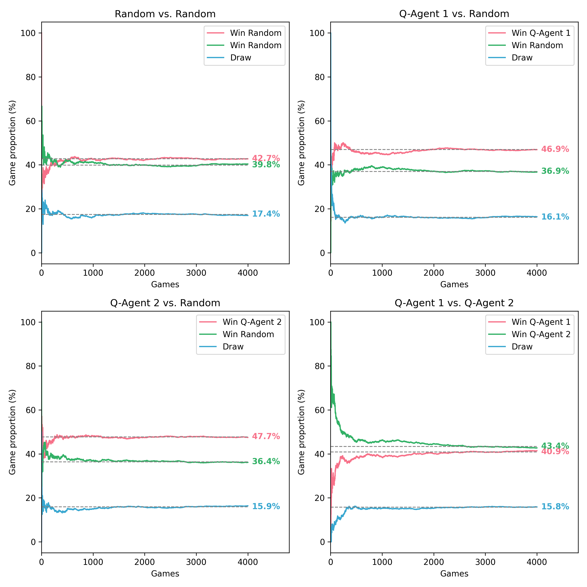

# Dice Game 421 AI

#### -- Project Status: [ Active ]

## Project Intro/Objective
Simple AI to play the French dice game 421 using the framework [gymnasium](https://gymnasium.farama.org/).

<!--
### Collaborators
|Name     |  Github Page   |  Personal Website  |
|---------|-----------------|--------------------|
|Nicolas Chagnet | [NicolasChagnet](https://github.com/NicolasChagnet)| [nicolaschagnet.github.io](https://nicolaschagnet.github.io)  | -->

<!-- ### Data sources -->

### Methods Used
* Reinforcement Learning (Q-learning)

### Technologies
* Python
* Pandas, Scikit-learn, numpy
* gymnasium

## Project Description
In this repository, I built an AI to play a specific dice game named 421 (pronounced "quatre vingt-et-un") in order to find interesting strategies and to learn how to use `gymnasium` for reinforcement learning.

### Rules of the game
- The game uses three dice. 
- In each round, a player must try to get the most valuable combination of dices possible in order to maximize their score. 
- In a round, a player can throw the dices up to three times (and at least once), selecting every time which one to keep.
- The game is played with 2 players, in each round the winner is the one with the larger combinations. Ties cancel the round.
- The player who wins a round starts the next one.
- The second player has at most the same number of throws that the first player *chooses* to use (at least one, at most 3).
- The winner is the first player to get a score difference larger >= 21.

The following combinations are the most valuable (ordered from stronger to weaker to settle ties):

| Combination | Value |
| ----------- | ----- |
| 421         | 8     |
| 111         | 7     |
| N11         | N     |
| NNN         | N     |
| 654         | 2     |
| 543         | 2     |
| 432         | 2     |
| 321         | 2     |
| ...         | 1     |
The last line refers to any non-special combination and the implicit order there is that the larger number wins.

## Content

### Game

The game structure is contained in `src/Dice421` and separated into various files and classes each encoding a specific aspect of the game. The game was written to be compatible with the framework [gymnasium](https://gymnasium.farama.org/). To keep it simple, the game output is simply logged to a file and to `stdout`.

The reward system for each action of the player is:
- `-1` point if the new combination is worse than the previous one or if it loses to the other player's combination,
- `0.5` point if the new combination only equalizes to the other player's combination,
- `1` point if the new combination is an improvement on the previous one,
- `1` point if the new combination beats the current combination of the other player,
- `N` points if the new combination leads the player to win the round (`N` is the value of the winning combination),
- `100` points if the new combination leads the player to win the game.

### Agents

In this code, three types of agents are included in `src/Agents`:

- A random agent which makes every decision randomly.
- A manual agent which asks the user for input. It serves as a direct interface to play the game manually.
- A Q-learning agent inspired by the [gymnasium Q-learning Blackjack agent](https://gymnasium.farama.org/tutorials/training_agents/blackjack_tutorial/#visualizing-the-training).

A Q-learning agent `Q-Agent 1` is eventually trained against the random agent, and a second Q-learning agent `Q-Agent 2` is then trained against the first Q-learning agent. This is done in [this notebook](agent_training.ipynb) and summarized in the following figure:

<!-- ## Featured Notebooks/Analysis/Deliverables
* [Notebook/Markdown/Slide Deck Title](#)
* [Notebook/Markdown/Slide DeckTitle](#)
* [Blog Post](#) -->
